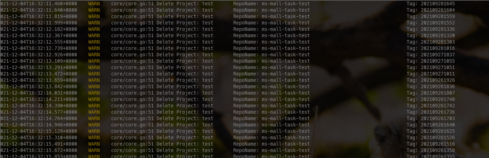

## `harborClear` 
`harborClear`是用于定期清理`harbor`的清理工具，配合`harbor2.0` 自动[垃圾清理] 可让`haobor`仅保存一定期限内的镜像，释放磁盘空间

## 变量说明

|变量名|作用|值|
|---|---|---|
|`harborClear_Projects`|要清理的项目,多个用`,`隔开|`test`或`test,prod`|
|`arborClear_KeepMonth`|要保留的期限,单位月|`1`或`10`|
|`harborClear_Loglevel`|日志级别|`info`或`debug`|
|`harborClear_HarborUrl`|`harbor`地址|`https://some.harbor.com`|
|`harborClear_HarborUser`|登入`harbor`的账户|`SOMEUSER`|
|`harborClear_UserPassword`|登入`harbor`的密码|`SOME_PASSWORD`|
|`harborClear_ClearFlag`|是否确认删除|`true`或`false`|
|`harborClear_KeepSave`|是否保留1个|`true`或`false`|


## expample

```sh
# cat ops/harborClear.sh 
#!/bin/bash
export harborClear_Projects=test,petest
export harborClear_KeepMonth=10
#export harborClear_Loglevel=debug
export harborClear_Loglevel=info
export harborClear_HarborUrl=https://some.harbor.com
export harborClear_HarborUser=admin
export harborClear_UserPassword=harbor12345
export harborClear_ClearFlag=true
export harborClear_KeepSave=true
./harborClear

```

## Screenshot
